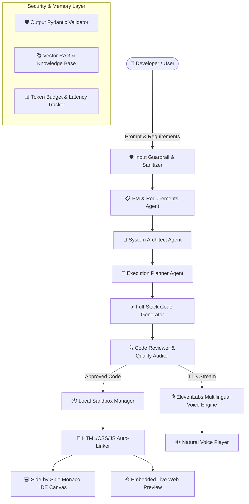

# 🤖 AgenticDev — Autonomous Multi-Agent Software Engineering Studio

<div align="center">

[](https://python.org)
[](https://fastapi.tiangolo.com)
[](https://react.dev)
[](https://langchain-ai.github.io/langgraph/)
[](https://elevenlabs.io)
[](https://pytest.org)
[](LICENSE)

**An autonomous multi-agent software engineering platform that designs, writes, reviews, and previews full-stack web applications in real-time.**

[Key Features](#-key-features) • [Architecture](#-system-architecture) • [Quick Start](#-quick-start) • [Feature Comparison](#-feature-comparison) • [Testing](#-testing)

</div>

---

## 🌟 Key Features

- **🤖 Autonomous Multi-Agent Orchestration**: LangGraph-powered state machine linking **PM Agent**, **System Architect**, **Full-Stack Coder**, and **Code Reviewer**.
- **💻 Side-by-Side Monaco IDE Canvas (Codex & Claude Style)**: Multi-file project explorer, live Monaco code editor, split git diff view, and instant embedded web preview.
- **🔗 Automatic File Linking Heuristic**: Automatically connects generated `index.html` with `style.css` and `script.js` without manual link injection.
- **🎙️ ElevenLabs Ultra-Realistic AI Voice**: Integrated Text-to-Speech (TTS) using ElevenLabs `eleven_multilingual_v2` model for natural voice narration of AI answers.
- **📱 100% Responsive Design**: Optimized for desktop monitors, laptops, tablets, and smartphones with collapsible mobile file drawers.
- **🛡️ Enterprise Security Guardrails**: Three-tier security layer (Input Sanitization, Output Schema Validation, and Execution Path Boundaries).
- **📦 Docker-Free Isolated Local Sandbox**: Zero Docker overhead — runs isolated per-session sandboxes natively with output truncation and resource safety bounds.
- **📚 RAG Knowledge Base & Memory**: Vector retrieval RAG engine supporting PDF, DOCX, CSV document indexing and context-aware chat memory.

---

## 🏗️ System Architecture



---

## 🚀 Quick Start

### 1. Prerequisites
- **Python**: 3.10 or higher
- **Node.js**: 18+ and npm
- **API Keys**: Gemini / OpenRouter API Key and ElevenLabs API Key

### 2. Backend Setup
```bash
# Clone repository
git clone https://github.com/codingsexpert/AgenticDev.git
cd AgenticDev

# Install Python dependencies
pip install -r requirements.txt

# Configure Environment
cp .env.example .env
# Edit .env and add your GEMINI_API_KEY / OPENROUTER_API_KEY and ELEVENLABS_API_KEY

# Start FastAPI Backend Server (runs on http://localhost:8000)
python3 server.py
```

### 3. Frontend Setup
```bash
# Navigate to frontend
cd frontend

# Install Dependencies
npm install

# Start Vite Development Server (runs on http://localhost:5173)
npm run dev
```

Open **`http://localhost:5173`** in your browser.

---

## ⚡ Feature Comparison

| Feature | Standard AI Chatbots | **AgenticDev Platform** |
| :--- | :---: | :---: |
| **Code Display** | Raw long text wall in chat bubble | **Clean Compact Cards + Side-by-Side IDE** |
| **Multi-File Workspace** | Fragmented single files | **Full Tree Explorer (`index.html`, `style.css`, `script.js`)** |
| **Auto File Linking** | ❌ Manual manual script tags needed | **✅ Automatic `<link>` and `<script>` auto-injection** |
| **Live Web Preview** | ❌ None | **✅ Instant embedded web preview iframe** |
| **AI Voice Engine** | Robotic Web Speech API | **✅ Ultra-Realistic ElevenLabs Multilingual Voice** |
| **Multi-Agent Flow** | Single LLM completion | **✅ LangGraph (PM ➔ Architect ➔ Coder ➔ Reviewer)** |
| **Safety Boundaries** | ❌ Minimal | **✅ 3-Tier Security Guardrails + Path Isolation** |
| **Mobile Responsiveness**| Broken layout on small screens | **✅ 100% Responsive with collapsible mobile drawers** |

---

## 🧪 Automated Testing Suite

The repository includes a comprehensive automated test suite powered by Pytest:

```bash
# Run all automated tests
python3 -m pytest tests/ -q
```

### Verified Test Categories:
- `test_api_endpoints.py`: End-to-end FastAPI endpoint tests (`/api/status`, `/api/auth`, `/api/tts/speak`).
- `test_graph_skeleton.py`: Verifies LangGraph state machine graph nodes & edge transitions.
- `test_guardrails.py`: Input injection prevention, output schema validation, and path traversal blocks.
- `test_sandbox_manager.py`: Local filesystem sandbox creation, command isolation, and output truncation.

---

## 📁 Repository Structure

```text
AgenticDev/
├── server.py                   # FastAPI Production Web Server
├── main.py                     # Multi-Agent CLI entrypoint
├── requirements.txt            # Python dependencies
├── .env.example                # Environment configuration template
├── frontend/                   # React + Vite Web Dashboard
│   ├── src/                    
│   │   ├── components/         # ArtifactsCanvas, ChatTimeline, PromptBar, Sidebar
│   │   ├── routes/             # Client-side SPA Routing
│   │   └── App.jsx             # Main Application layout
│   └── vite.config.js          # Vite Proxy & Build settings
├── src/                        # Core Python Engine
│   ├── agents/                 # Autonomous Agent Prompts & Specifications
│   ├── config/                 # AgentState & LangGraph Multi-Agent Graph
│   ├── guardrails/             # Security & Validation Engine
│   ├── nodes/                  # Operational Graph Execution Nodes
│   ├── routes/                 # FastAPI API Routers (/chats, /sandboxes, /tts, /auth)
│   └── utils/                  # Sandbox Manager, LLM Clients, Token Tracker
└── tests/                      # Automated Pytest Suite (29/29 Passed)
```

---

<div align="center">

Made with ❤️ for Developers, Recruiters & Open-Source Enthusiasts.

</div>
